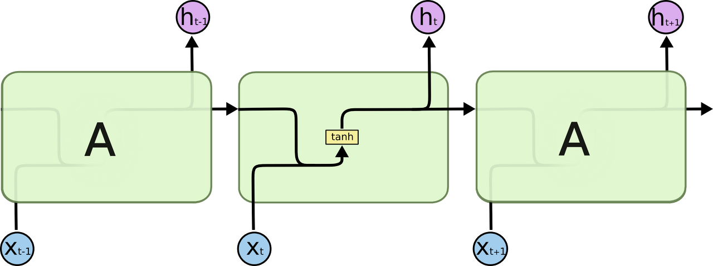
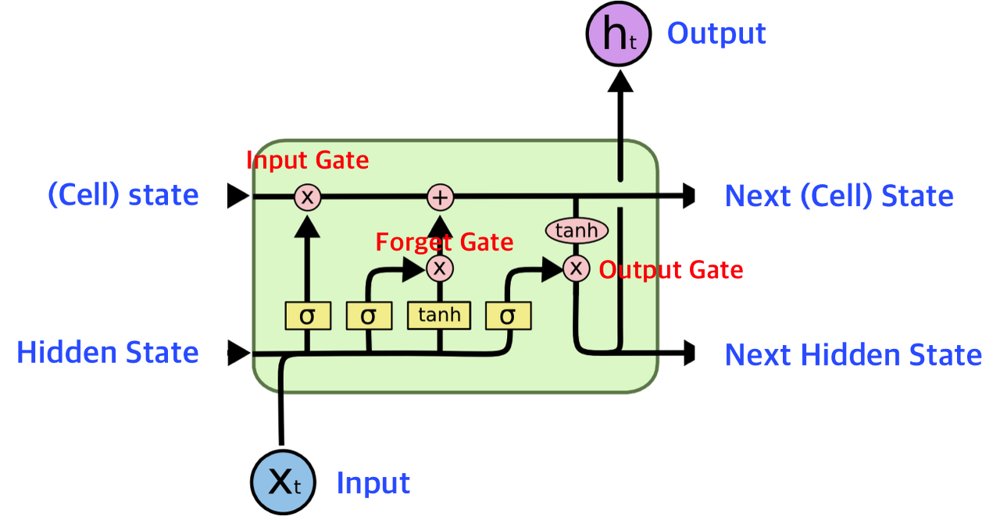
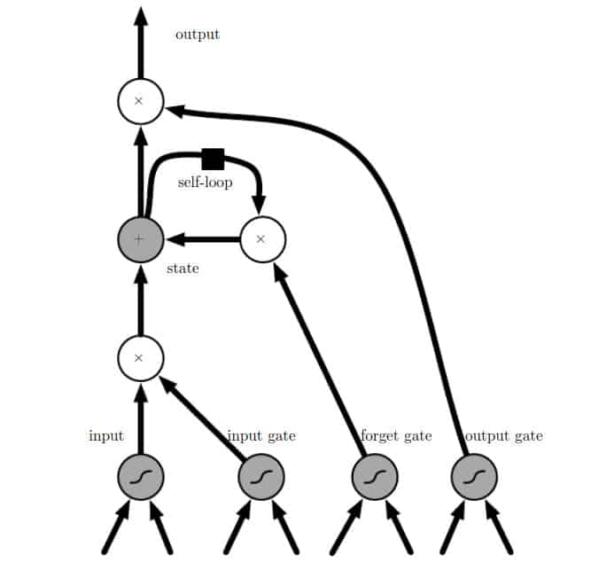
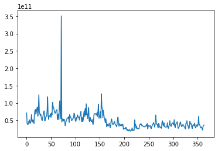
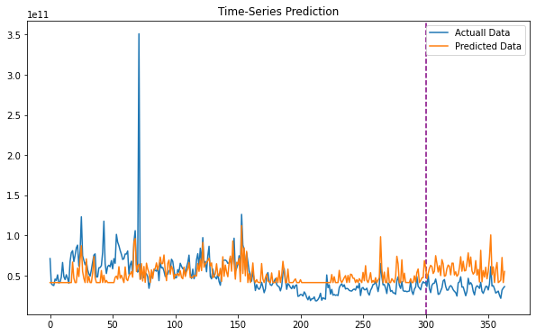

# 비트코인 데이터를 통해 주가 예측
2021 fall / AI-x:Deep-learning final project

# 맴버
물리학과 신중현 2016039534
E-mail : jhshin1030@naver.com
역할 : all


# I. 개요
AI + X : 딥러닝 final project
- 최근 암호화폐거래소로 투자자들이 몰리면서 비트코인 가격이 급등락하고 있습니다. 이러한 마구잡이처럼 보이는 비트코인 시장에서 과연 얼마나 예측이 가능한지. 그리고 예측한 모델이 얼마나 실제 데이터와 일치하는지를 확인해보고 딥러닝을 활용한 투자 가능성을 확인해 보았습다. 그리하여이 블로그에서는 딥러닝 모형을 이용하여 비트코인의 가격을 예측하고, 투자전략을 통해 비트코인의 수익성이 있는지를 분석하는 것이 목표입니다. 마지막으로 비선형성과 장기기억 특성을 보이는 비트코인 가격 예측모형으로는 LSTM을 활용하여 분석하였습니다.


# II. 데이터셋

데이터 출처 
https://finance.yahoo.com/quote/BTC-USD/history?period1=1410912000&period2=1639699200&interval=1d&filter=history&frequency=1d&includeAdjustedClose=true


| date | open | close |high|low  |market volume|
| :------------ | :-----------: | -------------------: | -------------------: | -------------: | -------------: | 
| 2013.04.28 | 135.3 | 134.21 |135.98|132.1 |1.49E+09 | 
| 2013.04.30 | 134.44 | 144.54 |147.49|134|1.6E+09 | 
|  |  |  | || | 
|  |  |  | || | 
|  |  |  | || | 
| 2021.12.01 | 56907.97 |57229.83|59041.69|56553.08 |1.08E+12 | [Table caption, works as a reference][section-mmd-tables-table1]

# III. 비트코인 예측을 위한 

먼저 비트코인의 데이터는 순차적 데이터입니다. 
순차적 데이터란 즉, 데이터의 순서가 중요한 일종의 데이터입니다. 예를들어 회사 A의 연간 주식시장 가격이라든지. 이런 종류의 데이터에서는 연도별로 확인해야 하기 때문에 순서와 추세를 찾아야 합니다. 연도의 순서를 변경이 불가능한 경우에 순차적 시계열 데이터 라고 할수 있습니다.

이러한 순차적 데이터를 활용하는 방법들이 생각해보았습니다. 전통적인 Neural Network에서는 이전에 일어난 사건을 바탕으로 나중에 일어나는 사건을 생각하지 못합니다. 따라서 RNN을 사용해서 스스로를 반복하면서 이전단계의 정보를 지속되도록하였습니다. 

그 중에서 LSTM (Long Shor-Term Memory)를 이용할것입니다. LSTM 은 RNN의 수정된 아키텍처이며, 긴 의존 기간을 필요로 하는 학습을 수행할 능력을 갖고 있습니다.
먼저 RNN의 구조를 살펴보고 LSTM의 구조를 살펴보겠습니다.

- RNN의 구조


이렇게 모든 RNN은 neural network 모듈을 반복시키는 체인과 같은 형태를 하고 있습니. 기본적인 RNN에서 이렇게 반복되는 모듈은 굉장히 단순한 구조를 가지고 있는데, tanh layer 한 층을 예로 들 수 있습니다. 또한, 여기에서 단순 신경망이 단방향임을 알 수 있습니다. 즉, 단일 방향을 갖는 반면, RNN에는 타임스탬프 t 동안 정보를 유지하기 위해 내부에 루프가 있습니다 . 이것이 RNN이 " 재귀적인 " 신경망 으로 알려진 이유이고 이 루핑은 시퀀스에 대한 정보를 보존합니다.
단순화된 설명은 시퀀스를 처리하기 위해 모든 타임스탬프에 적용되는 반복 관계 가 있다는 것 입니다.


- LSTM의 구조


LSTM도 똑같이 체인과 같은 구조를 가지고 있지만, 각 반복 모듈은 다른 구조를 갖고 있습니다. 단순한 neural network layer 한 층 대신에, 4개의 layer가 특별한 방식으로 서로 정보를 주고 받도록 되어 있습니다

일반적인 LSTM 단위는 셀 , 입력 게이트 , 출력 게이트 및 망각 게이트로 구성 됩니다. 세포는 임의의 시간 간격 동안 값을 기억하고 세 개의 게이트 는 세포 안팎으로 정보의 흐름을 조절합니다.

LSTM 네트워크는 시계열 에서 중요한 이벤트 사이에 알 수 없는 기간의 지연이 있을 수 있으므로 시계열 데이터를 기반으로 분류 , 처리 및 예측 하는 데 적합하다고 알려져있습니다 . LSTM은 전통적인 RNN을 훈련할 때 발생할 수 있는 그라디언트 소실 문제 를 처리하기 위해 개발되었습니다. 갭 길이에 대한 상대적인 둔감함은 RNN, 은닉 마르코프 모델 및 수많은 애플리케이션에서 기타 시퀀스 학습 방법 보다 LSTM의 장점입니다 . 
(출처 : 위키벡과)

다음은 위에 정의된 개념을 더 깊이 이해할 수 있도록 기본 LSTM 구조를 그래픽으로 나타낸 것입니다.


이제 LSTM의 핵심 개념을 간단히 요약해 보겠습니다.

1. LSTM은 출력되는 것과 별도의 셀 상태를 유지할 수 있습니다.

2. 정보의 흐름을 제어하기 위해 게이트를 사용합니다.

3. Forget Gate는 불필요한 정보를 제거하는 데 사용됩니다.

4. 현재 입력에서 관련 정보 저장

5. 셀 상태를 선택적으로 업데이트

출력 게이트는 
중단 없는 그라데이션 흐름으로 시간 에 따른 셀 상태 역전파  의 필터링된 버전을 반환합니다.

LSTM의 역전파는 RNN 섹션에서 설명한 방식과 유사하게 작동합니다.

- 
# IV. LSTM을 통한 비트코인 예측 구현 과정 & 결과

- pytorch를 이용해 bitcoin 데이터를 학습하여 구현하였다.


```python
LSTM을 이용한 Bitcoin 예측
```


```python
import numpy as np
import pandas as pd
import matplotlib.pyplot as plt
import torch
import torch.nn as nn
import pandas_datareader.data as pdr

import datetime
from torch.autograd import variable
import torch.optim as optim
from torch.utils.data import Dataset, DataLoader
```


```python
#불러올 파일의 경로를 filename 변수에 저장
filename = 'C:/Users/문서/BTC.csv'
df = pd.read_csv(filename)
```


```python
#pandas read_csv로 불러오기
df = pd.read_csv(filename,index_col ='Date' , parse_dates = True)
df.columns

```


    Index(['Open', 'High', 'Low', 'Close', 'Adj Close', 'Volume'], dtype='object')


```python
df.head()
df.shape
```


    (366, 6)
    
다음을 통헤 데이터의 헤드와 shape를 확인 할수 있습니다.
또한 shape의 크기에 따라 train set 과 test set을 정할 수 있습니다.

```python
X = df.iloc[:, :-1]
y = df.iloc[:, 5:6] 
#print(X) 
#print(y)

# open 시가
# high 고가 
# low 저가
# close 종가
# voulume 거래량
# Adj close 주식의 분할, 배당, 배분 등을 고려해 조정한 종가

# 확실한건 거래량 은 데이터에서 제하는것이 중요하다.

```


```python
y_n = np.array(y)
# #print(y_n.T)
len(y_n)
x_n= list(range(len(y_n)))
# #print(x_n)
import matplotlib.pyplot as plt
plt.plot(x_n,y_n)
plt.show()
# print(len(y_n))
```
이제 기간과 함께 레이블 열을 플롯하여 재고 볼륨의 원래 추세를 확인할 수 있습니다.

    

    


```python
# 학습이 잘되기 위해 데이터 정규화
# StandardScaler 각 특징의 평균을 0, 분산을 1이 되도록 변경
# MinMax Scaler  최대 / 최소 값이 각각 1, 0 이 되도록 변경
from sklearn.preprocessing import StandardScaler, MinMaxScaler
mm = MinMaxScaler()
ss = StandardScaler()


X_ss = ss.fit_transform(X)
y_mm = mm.fit_transform(y) 
```
 데이터 전처리 라고도 합니다.
이렇게 하면 데이터세트가 변환되고 크기가 조정됩니다. 다음은 데이터 세트를 두 부분으로 나누는 것입니다. 1은 훈련용이고 다른 부분은 값을 테스트하기 위한 것입니다. 순차 데이터이고 순서가 중요하기 때문에 처음 300개 행은 학습용으로, 53개 행은 데이터 테스트용으로 사용합니다. LSTM을 사용하여 이렇게 적은 양의 데이터에 대해 정말 좋은 예측을 할 수 있음을 알 수 있습니다 .
```python
#처음 300개를 트레이닝 셋으로 설정

X_train = X_ss[:300, :]
X_test = X_ss[300:, :]

print(X_train.shape)
print(X_test.shape)
y_train = y_mm[:300, :]
y_test = y_mm[300:, :] 
```

    (300, 5)
    (66, 5)
    


```python
print("Training Shape", X_train.shape, y_train.shape)
print("Testing Shape", X_test.shape, y_test.shape) 
```

    Training Shape (300, 5) (300, 1)
    Testing Shape (66, 5) (66, 1)
    


```python
import torch #pytorch
import torch.nn as nn
from torch.autograd import Variable 
```


```python
X_train_tensors = Variable(torch.Tensor(X_train))
X_test_tensors = Variable(torch.Tensor(X_test))

print(X_train_tensors.shape)
y_train_tensors = Variable(torch.Tensor(y_train))
y_test_tensors = Variable(torch.Tensor(y_test)) 
```

    torch.Size([300, 5])
    


```python
#reshaping to rows, timestamps, features

X_train_tensors_final = torch.reshape(X_train_tensors,   (X_train_tensors.shape[0], 1, X_train_tensors.shape[1]))


X_test_tensors_final = torch.reshape(X_test_tensors,  (X_test_tensors.shape[0], 1, X_test_tensors.shape[1])) 
```


```python
print("Training Shape", X_train_tensors_final.shape, y_train_tensors.shape)
print("Testing Shape", X_test_tensors_final.shape, y_test_tensors.shape) 
```

    Training Shape torch.Size([300, 1, 5]) torch.Size([300, 1])
    Testing Shape torch.Size([66, 1, 5]) torch.Size([66, 1])
    
이제 LSTM 모델을 빌드할 시간입니다. PyTorch는 훨씬 더 파이썬적이기 때문에 모든 모델은 nn.Module 슈퍼클래스 에서 상속되어야 합니다. 

여기에서 모든 중요한 변수와 레이어를 정의했습니다. 다음으로 같은 하이퍼파라미터가 서로 겹쳐진 2개의 LSTM 레이어를 사용할 것입니다( hidden_size 를 통해 ). 2개의 완전 연결 레이어, ReLU 레이어 및 일부 도우미 변수를 정의했습니다. 다음으로 LSTM의 정방향 패스를 정의합니다.

```python
class LSTM1(nn.Module):
    def __init__(self, num_classes, input_size, hidden_size, num_layers, seq_length):
        super(LSTM1, self).__init__()
        self.num_classes = num_classes #number of classes
        self.num_layers = num_layers #number of layers
        self.input_size = input_size #input size
        self.hidden_size = hidden_size #hidden state
        self.seq_length = seq_length #sequence length

        self.lstm = nn.LSTM(input_size=input_size, hidden_size=hidden_size,
                          num_layers=num_layers, batch_first=True) #lstm
        self.fc_1 =  nn.Linear(hidden_size, 128) #fully connected 1
        self.fc = nn.Linear(128, num_classes) #fully connected last layer

        self.relu = nn.ReLU()
    
    def forward(self,x):
        h_0 = Variable(torch.zeros(self.num_layers, x.size(0), self.hidden_size)) #hidden state
        c_0 = Variable(torch.zeros(self.num_layers, x.size(0), self.hidden_size)) #internal state
        # Propagate input through LSTM
        output, (hn, cn) = self.lstm(x, (h_0, c_0)) #lstm with input, hidden, and internal state
        hn = hn.view(-1, self.hidden_size) #reshaping the data for Dense layer next
        out = self.relu(hn)
        out = self.fc_1(out) #첫 dense 층
        out = self.relu(out) #relu
        out = self.fc(out) #마지막 output
        return out
```
여기에서 은닉 상태를 정의했고 내부 상태를 먼저 0으로 초기화했습니다. 우선, 현재 타임스탬프 t 의 입력과 함께 LSTM의 숨겨진 상태와 내부 상태를 전달할 것 입니다. 이것은 새로운 숨겨진 상태, 현재 상태 및 출력을 반환합니다. Dense Layer로 전달할 수 있도록 출력의 모양을 변경합니다. 다음으로 활성화를 적용하고 조밀한 계층에 전달하고 출력을 반환합니다.

이것으로 Forward Pass와 LSTM1 클래스가 완성 됩니다. 런타임에 모델을 훈련하는 동안 역전파 논리를 적용합니다.

이제 사용할 몇 가지 중요한 변수를 정의해 보겠습니다. 이것은 Epoch 수, 숨겨진 크기 등과 같은 하이퍼파라미터입니다.
```python

num_epochs = 1000 #1000 epochs
learning_rate = 0.001 #0.001 lr

input_size = 5 #number of features
hidden_size = 1 #number of features in hidden state
num_layers = 1 #number of stacked lstm layers

num_classes = 1 #number of output classes 
```
이제 클래스 LSTM1 개체를 인스턴스화 합니다

```python
lstm1 = LSTM1(num_classes, input_size, hidden_size, num_layers, X_train_tensors_final.shape[1]) #our lstm class 
```
Loss function과 optimizer를 정의해보자.

```python
criterion = torch.nn.MSELoss()    # mean-squared error for regression
optimizer = torch.optim.Adam(lstm1.parameters(), lr=learning_rate) 
```
이제 에포크 수를 루프하고, 순방향 패스를 수행하고, 손실을 계산하고, 최적화 단계를 통해 가중치를 개선합니다. # 모델 훈련

```python
for epoch in range(num_epochs):
  outputs = lstm1.forward(X_train_tensors_final) #forward pass
  optimizer.zero_grad() #caluclate the gradient, manually setting to 0
 
  # obtain the loss function
  loss = criterion(outputs, y_train_tensors)
 
  loss.backward() #calculates the loss of the loss function
 
  optimizer.step() #improve from loss, i.e backprop
  if epoch % 100 == 0:
    print("Epoch: %d, loss: %1.5f" % (epoch, loss.item())) 
```
이것은 1000 epoch에 대한 훈련을 시작하고 매 100 epoch에서 손실을 print합니다.


    Epoch: 0, loss: 0.32506
    Epoch: 100, loss: 0.00618
    Epoch: 200, loss: 0.00559
    Epoch: 300, loss: 0.00549
    Epoch: 400, loss: 0.00537
    Epoch: 500, loss: 0.00519
    Epoch: 600, loss: 0.00508
    Epoch: 700, loss: 0.00502
    Epoch: 800, loss: 0.00494
    Epoch: 900, loss: 0.00487
    
손실이 적고 잘 수행되고 있음을 알 수 있습니다. 데이터 세트에 대한 예측을 플롯하여 성능을 확인하겠습니다.

그러나 전체 데이터 세트에 대한 예측을 수행하기 전에 원본 데이터 세트를 모델에 적합한 형식으로 가져와야 합니다. 이는 위와 유사한 코드를 사용하여 수행할 수 있습니다.

```python
df_X_ss = ss.transform(df.iloc[:, :-1]) #old transformers
df_y_mm = mm.transform(df.iloc[:, -1:]) #old transformers

df_X_ss = Variable(torch.Tensor(df_X_ss)) #converting to Tensors
df_y_mm = Variable(torch.Tensor(df_y_mm))
#reshaping the dataset
df_X_ss = torch.reshape(df_X_ss, (df_X_ss.shape[0], 1, df_X_ss.shape[1])) 
```
이제 순방향 패스를 통해 전체 데이터 세트에 대한 예측을 수행하기만 하면 됩니다. 그런 다음 이를 플롯하기 위해 예측을 numpy로 변환하고 역변환합니다(실제 답을 확인하기 위해 레이블을 변환했으며 역변환해야 함) 그런 다음 플로팅합니다.

```python
train_predict = lstm1(df_X_ss)#forward pass
data_predict = train_predict.data.numpy() #numpy conversion
dataY_plot = df_y_mm.data.numpy()

data_predict = mm.inverse_transform(data_predict) #역변환
dataY_plot = mm.inverse_transform(dataY_plot)
plt.figure(figsize=(10,6)) #plotting
plt.axvline(x=300, c='purple', linestyle='--') #트레이닝 셋의 크기

plt.plot(dataY_plot, label='Actuall Data') #actual plot
plt.plot(data_predict, label='Predicted Data') #예측된 그래프
plt.title('Time-Series Prediction')
plt.legend()
plt.show() 
```


    


모델이 꽤 잘 수행되고 있음을 알 수 있습니다.
 
 
 
# V. 참고자료
- anconda jupyter note book 과 google colab에서 작업하였고, pytorch docutments, kaggle, blog 등을 보며 학습하였다.
- https://wikidocs.net/book/2788
- https://pytorch.org/tutorials/beginner/basics/quickstart_tutorial.html
- https://www.kaggle.com/meetnagadia/bitcoin-price-prediction-using-lstm/notebook
- https://coding-yoon.tistory.com/131
- https://finance.yahoo.com/quote/BTC-USD/history?p=BTC-USD (데이터 출처)


